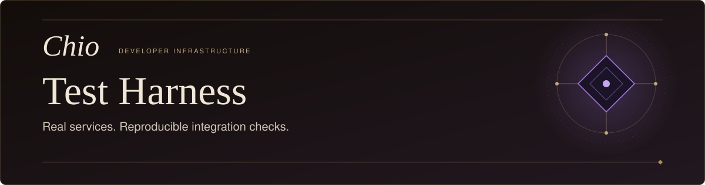
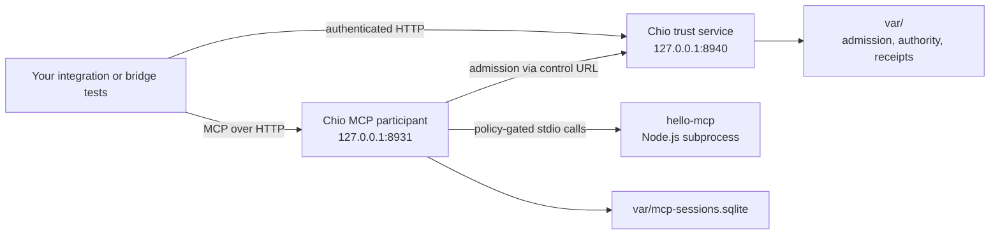

<p align="center">
  <picture>
    <source media="(max-width: 600px)" srcset="docs/assets/readme-hero-mobile.svg" />
    
  </picture>
</p>

<p align="center">
  <a href="https://github.com/backbay-labs/chio-test-harness/actions/workflows/ci.yml"></a>
  <a href="LICENSE"></a>
</p>

<p align="center"><strong>Test against real Chio services. Assemble delivery from exact artifacts.</strong></p>

<p align="center">
  <a href="#start-a-local-harness">Quickstart</a>&nbsp;&nbsp;&middot;&nbsp;&nbsp;
  <a href="#how-it-works">Architecture</a>&nbsp;&nbsp;&middot;&nbsp;&nbsp;
  <a href="#test-fixtures">Fixtures</a>&nbsp;&nbsp;&middot;&nbsp;&nbsp;
  <a href="#assemble-a-candidate-bundle">Delivery</a>&nbsp;&nbsp;&middot;&nbsp;&nbsp;
  <a href="#development">Development</a>
</p>

Chio Test Harness gives integration authors a local trust service, a policy-gated
MCP endpoint, and a small tool server for testing clients against the real kernel.
It starts the processes, checks readiness, and exports the endpoints and fixture
credentials your tests need.

Release operators can also use the [candidate bundle assembler](delivery/README.md)
to collect selected kernels, adapters, SDKs, images and owner helpers into a
checksummed installation with its own verifier.

**Scope:** the service quickstart below uses the exact kernel source selected by
this repository's CI. Required-agent bundles remain qualification candidates;
public release and per-host acceptance are separate gates. A healthy service or
successful API test does not establish containment of an agent host.

## Start a local harness

Use Bash on Linux or macOS, Node.js 22 or newer, Bun, Python 3, curl and OpenSSL.
The default loopback ports **8940** and **8931** must be free. The pinned CI setup
uses Node.js 22.19.0 and Bun 1.3.3; see the [workflow](.github/workflows/ci.yml).

Run these commands in a Bash session. A fresh clone keeps this test's state and
logs separate from any existing harness:

```bash
CHIO_TEST_ROOT="$(mktemp -d "${TMPDIR:-/tmp}/chio-harness.XXXXXX")"
git clone https://github.com/backbay-labs/chio-test-harness.git "$CHIO_TEST_ROOT/harness"
cd "$CHIO_TEST_ROOT/harness"
(cd hello-mcp && bun install --frozen-lockfile --ignore-scripts)
```

Set `CHIO_BIN` to an absolute path to a compatible kernel. The service baseline
in CI is Chio source `d8c5f53705173e614a853bad6c0a85acfdf1212b`. It supports the
durable trust owner and remote-control MCP participant used by `bin/start.sh`.
A version string alone does not identify that binary. Use a build from that
revision or a separately qualified compatible artifact.

<details>
<summary><strong>Build the API-harness baseline from public source</strong></summary>

Install Rust through rustup and the kernel's build prerequisites: a C toolchain,
Protobuf (`protoc`), pkg-config and OpenSSL development libraries. The pinned
checkout selects Rust 1.94.1. Its [build instructions](https://github.com/backbay-labs/chio/tree/d8c5f53705173e614a853bad6c0a85acfdf1212b)
and this repository's [Linux CI recipe](.github/workflows/ci.yml) provide context.

```bash
git init "$CHIO_TEST_ROOT/kernel"
git -C "$CHIO_TEST_ROOT/kernel" fetch --no-tags --depth=1 \
  https://github.com/backbay-labs/chio.git d8c5f53705173e614a853bad6c0a85acfdf1212b
git -C "$CHIO_TEST_ROOT/kernel" checkout --detach FETCH_HEAD
(cd "$CHIO_TEST_ROOT/kernel" && cargo build --locked -p chio-cli --bin chio)
export CHIO_BIN="$CHIO_TEST_ROOT/kernel/target/debug/chio"
```

This is the historical API-harness baseline, not the kernel selection for a
required-agent release. The [delivery guide](delivery/README.md) binds that
separate candidate to an explicit binary hash and source revision.

</details>

Start the services and load their client configuration:

```bash
test -x "${CHIO_BIN:?Set CHIO_BIN to the selected kernel executable}" && \
  bash bin/start.sh && source bin/env.sh
```

A fresh start prints `READY` after the trust health check and MCP initialization
succeed. `bin/env.sh` exports `CHIO_TRUST_URL`, `CHIO_MCP_URL`, `CHIO_TOKEN`,
`CHIO_POLICY`, `CHIO_BIN` and `CHIO_HARNESS_DIR` for your client tests. Keep the
fixture token private.

Check both services again, then stop them when your tests finish:

```bash
bash bin/wait-ready.sh
# Run your integration's client tests against the exported endpoints.
bash bin/stop.sh
```

`var/` holds this clone's token, PID files, logs and durable databases. Stop uses
those PID files and retains logs and databases. Use the same disposable clone
for startup and shutdown. Preserve diagnostics before a new start, which
truncates the logs. Repeated `start.sh` calls reuse live recorded processes; use
`wait-ready.sh` to recheck health. A failed start can leave a process running, so
run `stop.sh` from that clone after inspecting the failure.

For different ports, set `CHIO_TRUST_ADDR` and `CHIO_MCP_ADDR` before startup,
and the matching `CHIO_TRUST_URL` and `CHIO_MCP_URL` before sourcing `env.sh`.
Keep them on loopback. `CHIO_POLICY` selects an alternate policy, and
`CHIO_READY_TIMEOUT_SECS` controls the final readiness probe.

## How it works



The trust process owns durable admission, authority and receipts. The MCP
participant uses that remote control URL and keeps its own session identity.
These roles must share the same admission owner; mixing separate budget or
revocation stores would test a different configuration.

The tool server runs as a local subprocess. This harness provides real service
behavior for client compatibility tests; host isolation belongs to each
integration's supported execution mode.

## Test fixtures

| Tool | Behavior |
|---|---|
| `echo({ msg })` | Returns the supplied message. |
| `delete_file({ path })` | Attempts a real filesystem unlink; the canonical policy blocks this tool. |
| `paid_action({ usd })` | Returns a simulated charge and fixture receipt ID. No payment is made. |

The [canonical policy](policy/canonical.yaml) allows `echo` and `paid_action`,
blocks other tools, and sets an invocation limit. The
[tiny-budget policy](policy/tiny-budget.yaml) lowers that limit to three calls
per window; it does not test dollar-denominated spending. The
[extensions policy](policy/extensions.yaml) provides additional policy fixtures.
Cost-ceiling and approval-threshold tests need purpose-built capabilities and
requests; the canonical fixture does not cover those paths.

Use disposable sentinel files for denial tests and independently compare their
bytes after the request. An `echo` result, tool error, simulated payment ID or
returned denial is not itself a verified kernel receipt. Downstream tests should
verify the intended caller, request, signer and result, alongside resource effects.

The server's [manifest](hello-mcp/package.json) and [lockfile](hello-mcp/bun.lock)
pin MCP SDK `0.6.0`. Treat a change to that pin as a protocol-compatibility change
and test initialization and tool calls against the selected kernel.

## Assemble a candidate bundle

The [delivery guide](delivery/README.md) covers a separate installation workflow:

1. Select exact kernel, adapter, SDK, wheel and OCI image inputs.
2. Verify their identities and assemble a new immutable directory.
3. Create an archive, extract it into a fresh location, and verify the installed bytes.

The assembler supplies `manifest.json`, `SHA256SUMS` and a standalone `verify.py`.
Its [template](delivery/candidate-template.json) requires an explicit final kernel
binding and keeps publication and all six host acceptance fields unresolved.
It never obtains missing artifacts or publishes a release automatically.

See the [operator runbook](delivery/OPERATOR.md) for host installation,
authorization, recovery, upgrade and removal, and the
[resource-owner guide](delivery/RESOURCE-OWNER.md) for the protected filesystem
service. The [local candidate record](delivery/evidence/2026-09-10/static-docs-successor/README.md)
identifies the tested bundle and its limits. Saved OCI archives support delivery
without a private registry; their availability still needs a verified public
release path.

## Development

The harness is Bash, a small Node.js MCP server and a Python bundle assembler.
There is no TypeScript build step. Safe local source checks are:

```bash
bash -n bin/start.sh bin/env.sh bin/wait-ready.sh bin/stop.sh
node --check hello-mcp/server.mjs
python3 -m unittest discover -s delivery/tests -v
```

[CI](.github/workflows/ci.yml) runs the delivery integrity suite and builds the
pinned kernel for service startup, environment, readiness and shutdown checks.
Those jobs have different scope from real-host acceptance or release provenance.

The legacy `prep-release` script removes `var/` and may start services;
`verify-release` also needs a separate verification library. They are not part of
the quickstart or the standalone candidate assembler. Review them before use in
a dedicated release workspace.

[Chio kernel and protocol](https://github.com/backbay-labs/chio) ·
[TypeScript bridge](https://github.com/backbay-labs/chio-bridge) ·
[Delivery instructions](delivery/README.md) · [Apache-2.0](LICENSE)
